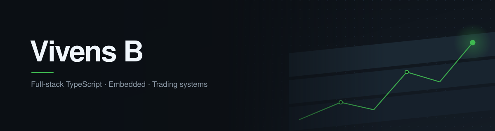

<picture>
  <source media="(prefers-color-scheme: dark)" srcset="./assets/banner-dark-v2.svg">
  <source media="(prefers-color-scheme: light)" srcset="./assets/banner-light-v2.svg">
  
</picture>

 

I build complete systems rather than pieces of them: firmware, the service that
ingests what it sends, and the interface someone opens to act on it.

Most of what I ship runs in production for real users, across vehicle telematics,
multi-tenant school platforms, trading infrastructure and Web3.

 

## Stack

**Languages**
 

**Web**
 

**Mobile**
 

**Backend & data**
 

**AI**
 

**Embedded**
 

**Trading & market data**
 

**Web3**
 

**DevOps & systems**
 

## Open source

<table>
<tr><td width="23%" valign="top"><a href="https://github.com/pnpm/pnpm/discussions/14282"><b>pnpm #14282</b></a> ✅</td>
<td valign="top">Established which <code>bin</code> entry <code>pnpm create</code> resolves, with the negative case proving the name match is required rather than preferred.</td></tr>

<tr><td width="23%" valign="top"><a href="https://github.com/tailwindlabs/tailwindcss/discussions/20443"><b>tailwindcss #20443</b></a></td>
<td valign="top">Bisected a CSS nesting regression across five releases to v4.3.3, where <code>&amp;__element</code> begins compiling to an invalid selector that later tooling drops without warning.</td></tr>

<tr><td width="23%" valign="top"><a href="https://github.com/supabase/supabase/discussions/49709"><b>supabase #49709</b></a></td>
<td valign="top">Reproduced an RLS <code>42501</code> across seven policy configurations on PostgreSQL 16, and showed the error naming a policy tells you which half of the policy set failed.</td></tr>

<tr><td width="23%" valign="top"><a href="https://github.com/nautechsystems/nautilus_trader/discussions/4880"><b>nautilus_trader #4880</b></a></td>
<td valign="top">Showed <code>Expectancy</code> is wholly invariant to breakeven trades, so <code>Expectancy × trades</code> stops recovering total PnL, and that the implementation contradicts the reference its own docstring cites.</td></tr>

<tr><td width="23%" valign="top"><a href="https://github.com/foundry-rs/foundry/discussions/16329"><b>foundry #16329</b></a></td>
<td valign="top">Separated <code>OpcodeNotFound</code> from <code>NotActivated</code> in revm. Only the latter is an EVM-version problem, so the usual fix does not apply to the former.</td></tr>

<tr><td width="23%" valign="top"><a href="https://github.com/nginx/nginx/discussions/1670"><b>nginx #1670</b></a></td>
<td valign="top">Proved <code>ssl_ech_file</code> fails on the Debian image too, so it is the TLS library not Alpine: stock OpenSSL exports zero <code>SSL_ech</code> symbols. It warns rather than errors, so ECH ships silently off.</td></tr>

<tr><td width="23%" valign="top"><a href="https://github.com/better-auth/better-auth/discussions/11026"><b>better-auth #11026</b></a></td>
<td valign="top">Demonstrated <code>SET search_path</code> leaking across tenants on a shared pool, and verified the alternative keeps them isolated on one reused connection.</td></tr>

<tr><td width="23%" valign="top"><a href="https://github.com/better-auth/better-auth/discussions/11030"><b>better-auth #11030</b></a></td>
<td valign="top">Found the library calls a custom fetch with a <code>URL</code> and a <code>Headers</code> instance, not a string and a plain object, which breaks strict React Native fetch replacements.</td></tr>

<tr><td width="23%" valign="top"><a href="https://github.com/better-auth/better-auth/discussions/11064"><b>better-auth #11064</b></a></td>
<td valign="top">Traced the OAuth callback to show <code>isRegister</code> fires exactly once, so an abandoned onboarding leaves a permanent gap the redirect never retries.</td></tr>

<tr><td width="23%" valign="top"><a href="https://github.com/trpc/trpc/discussions/7528"><b>trpc #7528</b></a></td>
<td valign="top">Traced which branches of a duplicated test helper were genuinely uncovered, then wrote the patch that closes the gap without widening the package's public API.</td></tr>

<tr><td width="23%" valign="top"><a href="https://github.com/tailwindlabs/tailwindcss/discussions/20439"><b>tailwindcss #20439</b></a></td>
<td valign="top">Measured a 7x build-memory difference from automatic source detection, and ruled out content, extension and recursion depth as the cause.</td></tr>

<tr><td width="23%" valign="top"><a href="https://github.com/colinhacks/zod/discussions/6454"><b>zod #6454</b></a></td>
<td valign="top">Rule-level validation tiers on a single field from one schema, with the <code>abort</code> flag that stops duplicate errors stacking.</td></tr>

</table>

✅ marked as the accepted answer.

  <a href="https://vivens.pro"><b>vivens.pro</b></a>
  &nbsp;·&nbsp;
  <a href="mailto:vivens.byiringiro77@gmail.com">vivens.byiringiro77@gmail.com</a>

