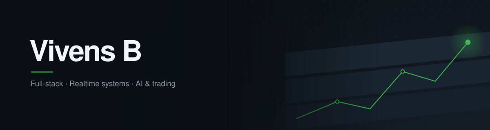
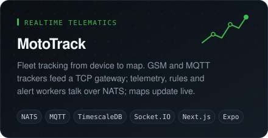
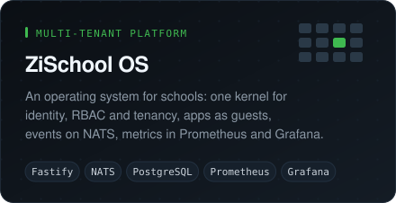
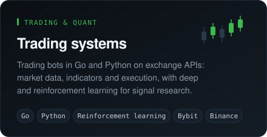
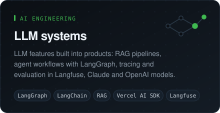
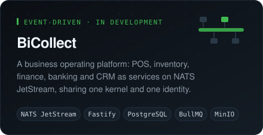
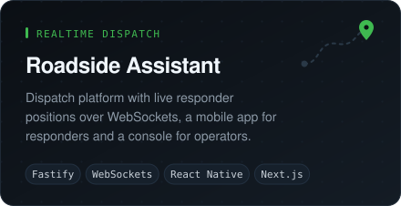
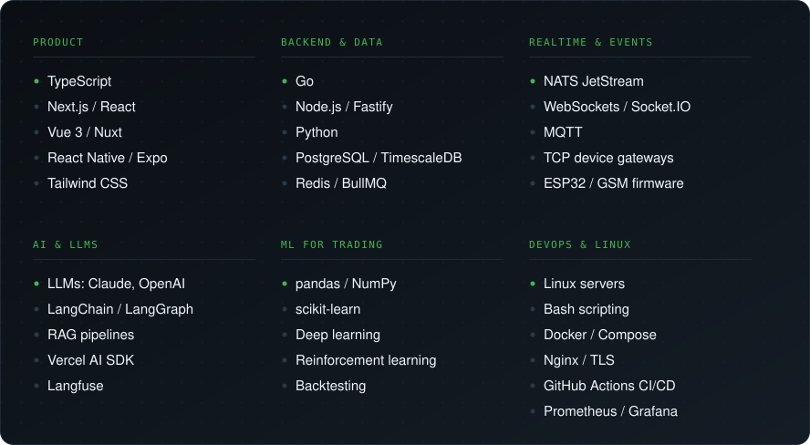

<picture>
  <source media="(prefers-color-scheme: dark)" srcset="./assets/banner-dark-v3.svg">
  <source media="(prefers-color-scheme: light)" srcset="./assets/banner-light-v3.svg">
  
</picture>

 

I build complete systems rather than pieces of them: firmware, the service that
ingests what it sends, and the interface someone opens to act on it.

Most of what I ship runs in production for real users, across vehicle telematics,
multi-tenant platforms, event-driven services on NATS, AI features and trading infrastructure.

## Selected work

  <picture>
    <source media="(prefers-color-scheme: dark)" srcset="./assets/card-mototrack-dark.svg">
    <source media="(prefers-color-scheme: light)" srcset="./assets/card-mototrack-light.svg">
    
  </picture>
  <picture>
    <source media="(prefers-color-scheme: dark)" srcset="./assets/card-zischool-dark.svg">
    <source media="(prefers-color-scheme: light)" srcset="./assets/card-zischool-light.svg">
    
  </picture>
  <picture>
    <source media="(prefers-color-scheme: dark)" srcset="./assets/card-trading-v2-dark.svg">
    <source media="(prefers-color-scheme: light)" srcset="./assets/card-trading-v2-light.svg">
    
  </picture>
  <picture>
    <source media="(prefers-color-scheme: dark)" srcset="./assets/card-ai-dark.svg">
    <source media="(prefers-color-scheme: light)" srcset="./assets/card-ai-light.svg">
    
  </picture>
  <picture>
    <source media="(prefers-color-scheme: dark)" srcset="./assets/card-bicollect-dark.svg">
    <source media="(prefers-color-scheme: light)" srcset="./assets/card-bicollect-light.svg">
    
  </picture>
  <picture>
    <source media="(prefers-color-scheme: dark)" srcset="./assets/card-roadside-v2-dark.svg">
    <source media="(prefers-color-scheme: light)" srcset="./assets/card-roadside-v2-light.svg">
    
  </picture>

## Stack

<picture>
  <source media="(prefers-color-scheme: dark)" srcset="./assets/stack-v2-dark.svg">
  <source media="(prefers-color-scheme: light)" srcset="./assets/stack-v2-light.svg">
  
</picture>

Also worked with: Laravel, Supabase, Prisma and Drizzle, MinIO, LiveKit, Solidity and Hardhat, AWS, Nx, Playwright.

## Open source

Projects I contribute to, mostly by reproducing and diagnosing reported behaviour:

[tailwindcss](https://github.com/tailwindlabs/tailwindcss) ·
[supabase](https://github.com/supabase/supabase) ·
[nautilus_trader](https://github.com/nautechsystems/nautilus_trader) ·
[foundry](https://github.com/foundry-rs/foundry) ·
[nginx](https://github.com/nginx/nginx) ·
[trpc](https://github.com/trpc/trpc) ·
[better-auth](https://github.com/better-auth/better-auth) ·
[zod](https://github.com/colinhacks/zod) ·
[pnpm](https://github.com/pnpm/pnpm) ·
[nuxt](https://github.com/nuxt/nuxt)

Next: contributing to Linux and the open source infrastructure around it.

 

  <a href="https://vivens.pro"><b>vivens.pro</b></a>
  &nbsp;·&nbsp;
  <a href="mailto:vivens.byiringiro77@gmail.com">vivens.byiringiro77@gmail.com</a>

